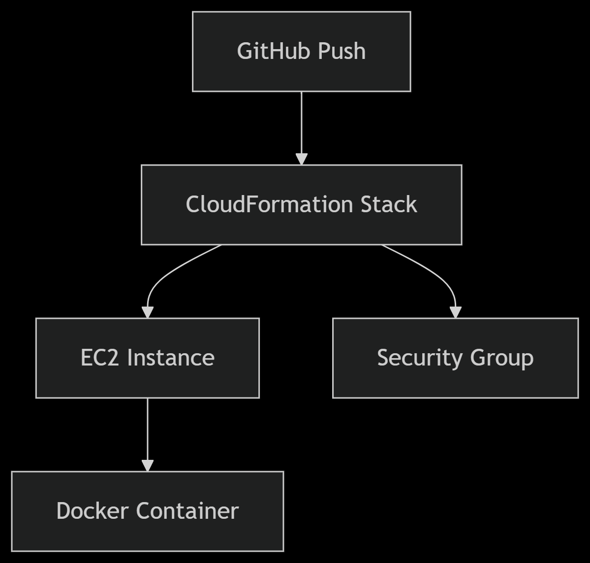

# ☁️ Social Media App - Cloud Deployment (AWS + GitHub Actions)

This project demonstrates deploying a simple Java-based social media web application to the cloud using **AWS EC2**, **CloudFormation**, and **GitHub Actions**.

## 🚀 Features

- User registration and post creation (core functionalities)
- Dockerized Java web application
- Infrastructure as Code using AWS CloudFormation
- Automated CI/CD pipeline using GitHub Actions
- Deployment to AWS EC2 instance

---

## 🧱 Tech Stack

- **Java** (Web application)
- **Docker** (Containerization)
- **AWS EC2** (Hosting the app)
- **AWS CloudFormation** (Infrastructure provisioning)
- **GitHub Actions** (CI/CD automation)

---


---

## 🛠️ Setup Instructions

### 1. 📦 Prerequisites

- AWS account (Free tier)
- EC2 Key Pair (`myKeyPair`)
- AWS CLI and Docker installed locally (for manual testing)
- GitHub repository with Secrets configured:
    - `AWS_ACCESS_KEY_ID`
    - `AWS_SECRET_ACCESS_KEY`
    - `AWS_REGION`
    - `SSH_PRIVATE_KEY` (corresponding to your `myKeyPair.pem`)

---


## Deployment Workflow


### 2. 🏗️ Infrastructure Setup

The infrastructure is defined in `cloudformation.yml` and is deployed using GitHub Actions.

This creates:

- An EC2 instance (Amazon Linux or Ubuntu)
- Security groups to allow SSH (port 22) and HTTP (port 80)
- Outputs the EC2 public IP for deployment

---

### 3. 🤖 CI/CD Workflow

The GitHub Actions pipeline (`deploy.yml`) consists of two jobs:

#### **Job 1: Deploy Infrastructure**
Deploys your AWS infrastructure via CloudFormation:

```
aws cloudformation describe-stacks \
            --stack-name ${{ env.STACK_NAME }} \
            --query 'Stacks[0].Outputs[?OutputKey==`PublicIP`].OutputValue' \
            --output text
```
#### **Job 2: Build and Deploy App
Builds the Docker image

Transfers it to EC2

Runs it in a container on port 80
